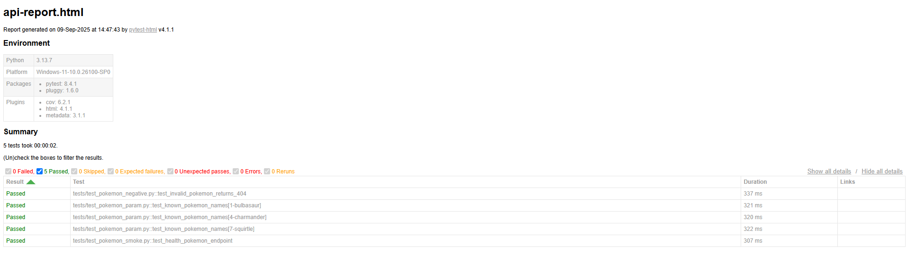
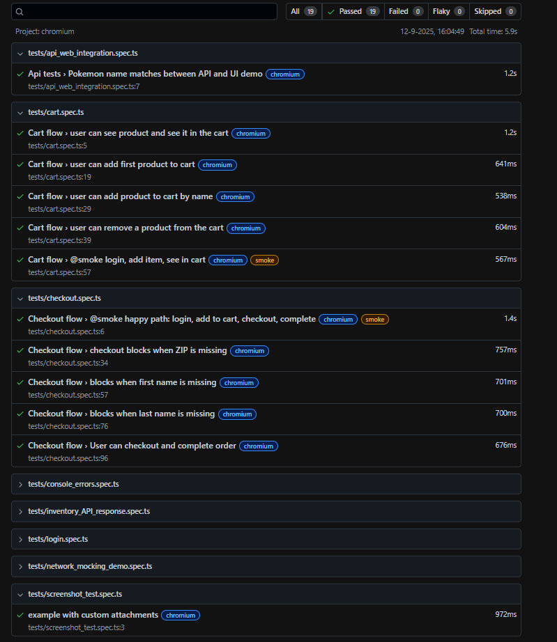

# QA Automation Portfolio

  

---
# 📖 Overview

This project demonstrates API and Web automation with CI/CD pipelines, reporting, and coverage — similar to real QA team setups.

It showcases:

API testing with Pytest + coverage + HTML reports

Web UI testing with Playwright + TypeScript + Page Object Model

CI/CD pipelines in GitHub Actions (push/PR triggers, smoke/regression tags, artifacts)

Reporting & coverage with Codecov and GitHub Pages

# 🚀 Features

API Tests → Python + Pytest + Coverage + HTML report

Web UI Tests → Playwright + TypeScript + Page Object Model + path aliases

Test Tagging → @smoke and @regression

GitHub Actions CI/CD

API tests run on every push + PR

Smoke tests (@smoke) run on push

Regression tests (@regression) run on PRs + main branch

Artifacts uploaded (reports, traces, screenshots, coverage)

Badges → Build Status + Code Coverage

# 📂 Project Structure
qa-automation-portfolio/
├── api_tests/
│   ├── tests/                # API test cases
│   ├── conftest.py           # Shared fixtures
│   └── pytest.ini            # Pytest config
├── web_tests/
│   ├── tests/                # UI test cases
│   ├── pages/                # Page Object Model
│   ├── playwright.config.ts  # Playwright config
│   └── tsconfig.json         # Path aliases
├── .github/
│   └── workflows/            # CI/CD workflows
├── docs/                     # Screenshots & published reports
├── reports/                  # Local test reports
├── requirements.txt          # Python deps
├── package.json              # Node deps
└── README.md

# ⚙️ Usage

# Run API Tests
🔹 Install Python dependencies
pip install -r requirements.txt

🔹 Run all API tests with coverage + HTML report
python -m pytest api_tests \
  --html=reports/api-report.html --self-contained-html \
  --cov=api_tests --cov-report=html

# Run Web Tests
🔹 Install Node.js dependencies
npm install

🔹 Run all Playwright tests
npx playwright test

🔹 Run smoke tests only
npx playwright test --grep @smoke

🔹 Run regression tests only
npx playwright test --grep @regression

# 📊 Sample Reports & Screenshots

🔹 API Test Report (Pytest)
- [View API Coverage on Codecov](https://codecov.io/gh/Marblehead0/qa-automation-portfolio)
- Local sample report generated at: `reports/api-report.html`
- Example screenshot:

🔹 Web Test Report (Playwright)
- [Live Smoke Report](https://Marblehead0.github.io/qa-automation-portfolio/web-smoke-report/index.html)
- [Live Regression Report](https://Marblehead0.github.io/qa-automation-portfolio/web-regression-report/index.html)
- Example screenshot:

### 🔹 Coverage Report (HTML)
- Local HTML coverage report generated at: `htmlcov/index.html`
- Uploaded automatically to Codecov

(Reports and screenshots are stored in reports/ and uploaded as GitHub Actions artifacts.)

# 🏗️ CI/CD Workflows

API tests → on push & PR

Smoke tests → on push

Regression tests → on PR & main

Reports deployed to GitHub Pages under /docs/.

# ✅ Status Badges

## ✅ Status Badges

  
  
  
  
  

# 👨‍💻 Tech Stack

Python (Pytest, Coverage, HTML reporting)

TypeScript (Playwright, Page Object Model)

GitHub Actions (CI/CD, artifacts, Pages deployment)

Codecov (coverage tracking)

# 📌 Future Improvements

API contract testing (schemathesis, pydantic)

Visual regression for UI

Allure reports integration

Docker setup for local runs

# 🐳 Run with Docker

Run the project inside Docker without installing Python, Node, or Playwright locally.

🔹 Build the image
docker-compose build

🔹 Run API Tests
docker-compose run --rm api-tests

Generates API HTML report → reports/api-report.html

Generates coverage report → htmlcov/index.html

🔹 Run Web Smoke Tests
docker-compose run --rm web-smoke

Generates Playwright HTML report → web_tests/playwright-report/index.html

Saves artifacts (traces, screenshots, videos) → web_tests/test-results/

🔹 Run Web Regression Tests
docker-compose run --rm web-regression

Generates Playwright HTML report → web_tests/playwright-report/index.html

Saves artifacts → web_tests/test-results/

✅ With Docker, everything runs in an isolated container, so recruiters can run your full suite with just one command per test type.

