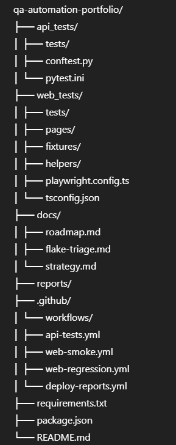

# QA Automation Portfolio

---
# 📖 Overview

This project demonstrates API and Web automation with CI/CD pipelines, reporting, and coverage — similar to real QA team setups.

It showcases:

API testing with Pytest + coverage + HTML reports

Web UI testing with Playwright + TypeScript + Page Object Model

CI/CD pipelines in GitHub Actions (push/PR triggers, smoke/regression tags, artifacts)

Reporting & coverage with Codecov and GitHub Pages

# 🚀 Features

API Tests → Python + Pytest + Coverage + HTML report

Web UI Tests → Playwright + TypeScript + Page Object Model + path aliases

Test Tagging → @smoke and @regression

GitHub Actions CI/CD

API tests run on every push + PR

Smoke tests (@smoke) run on push

Regression tests (@regression) run on PRs + main branch

Artifacts uploaded (reports, traces, screenshots, coverage)

Badges → Build Status + Code Coverage

# 📂 Project Structure

# ⚙️ Setup & Usage

🔹 Environment Setup
# Copy the example environment file
cp .env.example .env

# Edit `.env` with your own values (e.g. BASE_URL, USERNAME, PASSWORD)

ℹ️ Note: `.env` is for **local runs** only.  
In **CI (GitHub Actions)**, environment variables are injected via **GitHub Secrets** — see `.github/workflows/`.
---

# Run API Tests
🔹 Install Python dependencies
pip install -r requirements.txt

🔹 Run all API tests with coverage + HTML report
python -m pytest api_tests \
  --html=reports/api-report.html --self-contained-html \
  --cov=api_tests --cov-report=html

# Run Web Tests
🔹 Install Node.js dependencies
npm install

🔹 Run all Playwright tests
npx playwright test

🔹 Run smoke tests only
npx playwright test --grep @smoke

🔹 Run regression tests only
npx playwright test --grep @regression

# 🌍 Running Against Different Environments

By default, tests run against the local demo environment.
You can switch targets using the ENV variable:

🔹 Run Web tests against staging
ENV=staging npx playwright test

🔹 Run API tests against staging
ENV=staging python -m pytest api_tests

🔹 Run against production
ENV=prod npx playwright test

## Environment resolution order:

1. If BASE_URL or API_BASE_URL is explicitly set
   (via .env or GitHub Secrets) → use that
2. Else, check ENV (local | staging | prod) → map to known URLs
3. Else, fall back to local defaults
   (SauceDemo / PokeAPI)

# 📊 Sample Reports & Screenshots

🔹 API Test Report (Pytest)
- [View API Coverage on Codecov](https://codecov.io/gh/Marblehead0/qa-automation-portfolio)
- Local sample report generated at: `reports/api-report.html`
- Example screenshot:

🔹 Web Test Report (Playwright)
- [Live Smoke Report](https://Marblehead0.github.io/qa-automation-portfolio/web-smoke-report/index.html)
- [Live Regression Report](https://Marblehead0.github.io/qa-automation-portfolio/web-regression-report/index.html)
- Example screenshot:

### 🔹 Coverage Report (HTML)
- Local HTML coverage report generated at: `htmlcov/index.html`
- Uploaded automatically to Codecov

(Reports and screenshots are stored in reports/ and uploaded as GitHub Actions artifacts.)

# 🏗️ CI/CD Workflows

API tests → on push & PR

Smoke tests → on push, Chromium only

Regression tests → on PR & main, Chromium + Firefox + WebKit (matrix)

Reports deployed to GitHub Pages under /docs/.

# ✅ Status Badges

  
  
  
  
  

# 👨‍💻 Tech Stack

Python (Pytest, Coverage, HTML reporting)

TypeScript (Playwright, Page Object Model)

GitHub Actions (CI/CD, artifacts, Pages deployment)

Codecov (coverage tracking)

# 📌 Future Improvements

API contract testing (schemathesis, pydantic)

Visual regression for UI

Allure reports integration

Docker setup for local runs

# 🐳 Run with Docker

Run the project inside Docker without installing Python, Node, or Playwright locally.

🔹 Build the image
docker-compose build

🔹 Run API Tests
docker-compose run --rm api-tests

Generates API HTML report → reports/api-report.html

Generates coverage report → htmlcov/index.html

🔹 Run Web Smoke Tests
docker-compose run --rm web-smoke

Generates Playwright HTML report → web_tests/playwright-report/index.html

Saves artifacts (traces, screenshots, videos) → web_tests/test-results/

🔹 Run Web Regression Tests
docker-compose run --rm web-regression

Generates Playwright HTML report → web_tests/playwright-report/index.html

Saves artifacts → web_tests/test-results/

# 🛡️ Resilience Patterns (Playwright)
- Locator-based waits (`expect(locator).toBeVisible()`) instead of sleeps
- URL waits (`await expect(page).toHaveURL(/inventory\.html/)`)
- Console error capture per test (fails if any JS `console.error`)
- Network controls: block 3rd-party analytics; mock API responses where needed

📌 See [Flake Triage Guide](docs/flake-triage.md) for how we handle flaky tests.

